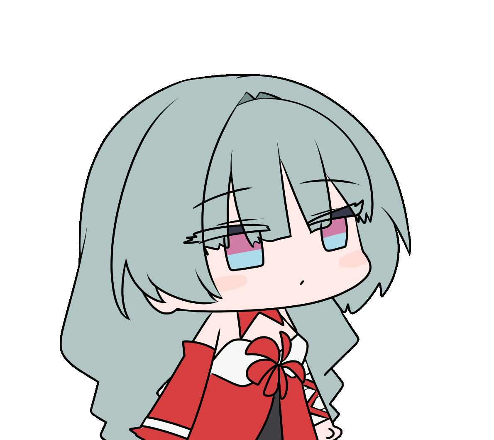

 

# Accelra

 

  

  
  
  

  
  

---

<table>
<tr>
<td colspan="2">
  
</td>
</tr>
<tr>
<td width="45%" align="center" valign="middle">
  
</td>
<td width="55%" align="center" valign="middle">

<h3>AI / Data / MLOps</h3>

I build AI projects by studying large repositories, rebuilding their pipelines,
and tuning experiments into clean engineering artifacts.

 

<h3>Tech Stack</h3>

 
 
 

 

</td>
</tr>
</table>

---

## GitHub Stats

---

## Achievements

